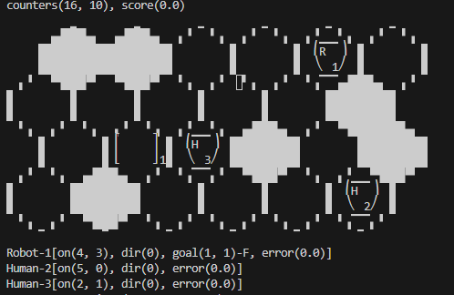

# [SCHOOL PROJECT] 
# Implementation of various algorithms to find the best strategy for mutliple games

# First game : 421

## What is 421 dices game ?

421 is a __3-dice game__. The player can roll several times to get a combination. The player can perform one and only one action on his turn, and the game stops automatically after 2 turns.

The actions consist in keeping or rolling each of the 3 dices. So there are 8 possible actions:

```python
actions = ['keep-keep-keep', 'keep-keep-roll', 'keep-roll-keep', 'keep-roll-roll', 'roll-keep-keep', 'roll-keep-roll', 'roll-roll-keep', 'roll-roll-roll' ]
```

The goal is to optimize the combination of dices before the end of the 2 turns. The best combination ever is 4-2-1 for 800 points. But you can explore other combinations.

The dices are always sorted from strongest to weakest.

Here's an example of a game :

> Game: 421-Solo
Horizon: 2 DICES: [6, 3, 1]
Action: roll-keep-keep
Horizon: 1 DICES: [3, 2, 1]
Action: roll-keep-keep
Horizon: 0 DICES: [6, 2, 1]
Results: 106

## How are the scores calculated ?

The scores are calculated based on the following method, where state is the combination :

* 421 is worth 800 points
* 111 is worth 600 points
* Any combination with two 1 is worth 400 points + the value of the highest dice

* Any combination with the same two numbers is worth 300 points + the value of the highest dice

* A straight is worth 200 points + value of the higher dice (654 is worth 206 points)

* Any other combination is worth 100 points + the value of the higher dice

The optimum average score out of a lot of games is expected to be around 340 points.

## How to play ?

### Solo version

In this version, the goal is to get the highest combination possible and the highest score at the end for the n games.

1. Go to this [website](https://imt-mobisyst.bitbucket.io/hackagames/) and follow the "Install" section.

2. Once it's done and the required depencies are downloaded, clone this repo at the root of the newly created _hacka-workspace_ folder.

3. To launch one of the bots, you need to run two terminals :

    * In the first one, go to the this folder _hacka-workspace\hackagames\gamePy421_ and launch the following command to start the server for two games with:
        <br/>
        
        `$ python ./hackagames/gamePy421/start-server` <br/><br/>

        You can add the option `-n number_of_games` to emulates number_of_games games. At the end, you'll get the average score for all the iterations.
        <br/>

        > Tips : when playing a lot of games, it is recommended to comment the prints to get a better execution time

    * In the second one, move to one of the folders located in 421 folder and launch the following command make the bot join the server to play the games :
        <br/>
        
        `$ python ./hacka-games/421/policy/classic/name_of_the_python_file` <br/><br/>

### Duo version

In this version, the goal is to get a better score than your opponent. The first player sets the number of round for the game. The second player then has to do obtain a higher score, knowing the combination of the first player.

To launch two players, you just have to open a third terminal. You can then refers to the commang to make a bot join the server so the two selecte bots can fight against each other.

## Bots available :

There are mutliple bots available :

|               Name              | Average score (50000 games)            | Description                                                                                                                                                                                                                                                                                                                                                                                                                                                                                                                      |
|:-------------------------------:|----------------------------------------|----------------------------------------------------------------------------------------------------------------------------------------------------------------------------------------------------------------------------------------------------------------------------------------------------------------------------------------------------------------------------------------------------------------------------------------------------------------------------------------------------------------------------------|
|          myPy421Bot.py          |                   240                  | Basic bot using a default policy.                                                                                                                                                                                                                                                                                                                                                                                                                                                                                                |
|      myPy421BotQLearning.py     | 240 (but score ~280 after 25000 games) | Bot using the QLearning algorithm. It learns the best possible action depending on the state (dices combination) while playing. The QValues computed during the games are stored at the end in the file called _QValues.json_                                                                                                                                                                                                                                                                                                                                                                                                  |
|          myPy421Bot2.py         |      _Implementation in progress_      | Bot based on the probability to get a better hand knowing the hand we currently have and the action we can perform.                                                                                                                                                                                                                                                                                                                                                                                                              |
|       myPy421BotPolicy.py       |                   325                  | This bot works in two phases. First one is to build the policy and the second one to use it in games:   First, set the `show_json` variable to True and launch n games (the greater n is, the better the policy will be). The bot will log all the states, actions and scores obtained and will create a policy "combination" : "action_to_perform". It is then in the file _player_policy.json_. Then, set the `show_json` variable to False so the bot can play the games only using the newly created policy. |
| myPy421BotPolicyWithHorizons.py |      _Implementation in progress_      | Same as the _myPy421BotPolicy.py_ but this time we take into consideration the turn (horizons) we are at.                                                                                                                                                                                                                                                                                                                                                                                                                        |
|       myPy421BotPolicy.py       |                   /                  | Bot using the QLearning algorithm. It learns the best possible action depending on the state (dices combination) adn the opponent hand while playing. The QValues computed during the games are stored at the end in the file called q_values_duo.json

## How to create your own bot ?

To do so, please refer to [this section of the HackaGames website](https://imt-mobisyst.bitbucket.io/hackagames/4.2.1-solo/).


# Second game : MoveIt

## What is MoveIt game ?

You play a robot on a 4 * 6 hexagonal tiles board. Your goal is to move the robot to a target. A game is composed of 10 targets to reach with 16 moves availables per cycle.

Every game, 6 cells are set to be obastacles and two humans are also moving on the map. They move from one direction to an other but you don't know their destinations. They can also stay still.

Every time the robot tries to move to a location occupied by a human or hit an obstacle, your score gets lower. The goal of the game is to reach the maximum amount of targets while maximizing your final score.




The robot can perform each turn 1 action out of the 8 available.

It can :

* ```move x``` where x is the direction where you want to go. They are numbered from 1 to 6 starting from the NE. In the image above, the direction 1 is out of the board, direction 2 is the cell to the right, direction 3 leads to an obstacle ... The cell you are currently on is the 0. If you want to stay still, move 0.

* ```pass``` passes the current target and define a new one. The robot doesn't move.

## How to play ?

1. Go to this [website](https://imt-mobisyst.bitbucket.io/hackagames/) and follow the "Install" section.

2. Once it's done and the required depencies are downloaded, clone this repo at the root of the newly created _hacka-workspace_ folder.

3. To launch one of the bots, you need to run two terminals :

    * In the first one, go to the this folder _hacka-workspace\hackagames\gameMoveIt_ and launch the following command to start the server for two games with:
        <br/>
        
        `$ python ./hackagames/gameMoveIt/start-server` <br/><br/>

        You can add the option `-n number_of_games` to emulates number_of_games games. At the end, you'll get the average score for all the iterations.
        <br/>

        > Tips : when playing a lot of games, it is recommended to comment the prints to get a better execution time

    * In the second one, launch the following command make the bot join the server to play the games :
        <br/>

        * To play interactively :
        `$ python ./hackagames/gameMoveIt/playerInteractive.py` <br/><br/>

        * To launch the bot, move to the _moveIt_ folder and run :
        `$ python ./myMoveItPyBot.py` <br/><br/>

## Bots available

|               Name              | Average score (10000 games)            | Description                                                                                                                                                                                                                                                                                                                                                                                                                                                                                                                      |
|:-------------------------------:|----------------------------------------|----------------------------------------------------------------------------------------------------------------------------------------------------------------------------------------------------------------------------------------------------------------------------------------------------------------------------------------------------------------------------------------------------------------------------------------------------------------------------------------------------------------------------------|
|          myMoveItPyBot.py          |                   -1800                  | Bot using only a QLeraning algorithm to learn the game. Its score is very mediocre as the number of state to visit is very high leading the bot to make very poor choices. A new bot combining a decision tree and QLearning algorithm is coming soon.